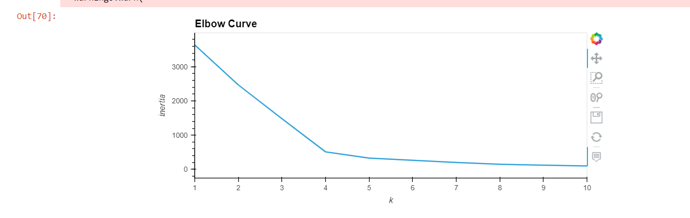
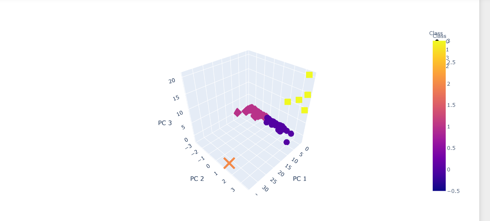
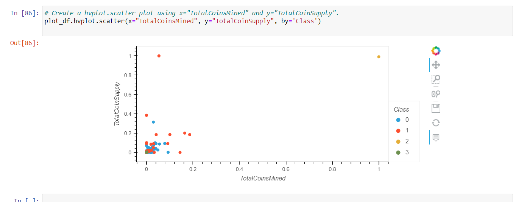

# Unsupervised Machine Learning with Cryptocurrencies

## Overview of the project

- The purpose of this project is to create a report that includes what cryptocurrencies are on the trading market and how they could be grouped to create a classification system for this new investment.

## Results

- For some reason when I uploaded the ipnyb file to Github, the graphs do not show up in the code, so I am putting the screenshots here.
- Below is the elbow curve graph.
-  
- Below is the 3D scatter graph.
- 
- Below is the hvplot.scatter plot.
- 

